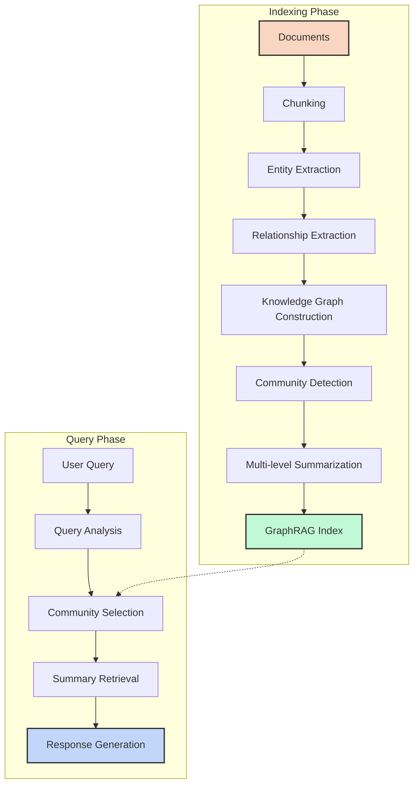

# Step Snap 1: [The Knowledge Network Revolution]

**1. Why Traditional RAG Falls Short**
Imagine a detective trying to solve a complex case by only looking at random pages from case files:

- **The Isolated Chunks Problem**: Traditional RAG sees trees but misses the forest
- **Limited Relationship Awareness**: Like reading a family tree as a list of individual names
- **Missing the Big Picture**: Can answer "Who is Bob?" but struggles with "How are all these people connected?"

**Why GraphRAG changes everything:**

- **Connected Intelligence**: Creates a web of knowledge instead of a pile of fragments
- **Relationship-Powered Insights**: Understands that in real knowledge, connections matter as much as facts
- **Hierarchical Understanding**: Builds a mental model similar to how humans process information

```python
# Traditional RAG vs GraphRAG conceptual difference
def traditional_rag(query, documents):
    chunks = split_into_chunks(documents)
    embeddings = compute_embeddings(chunks)
    relevant_chunks = retrieve_similar_chunks(query, embeddings)
    return generate_answer(query, relevant_chunks)

def graph_rag(query, documents):
    chunks = split_into_chunks(documents)
    # The magic happens here:
    entities = extract_entities(chunks)
    relationships = discover_relationships(entities, chunks)
    knowledge_graph = build_graph(entities, relationships)
    communities = detect_communities(knowledge_graph)
    summaries = create_hierarchical_summaries(communities)
    relevant_summaries = retrieve_relevant_communities(query, summaries)
    return generate_answer(query, relevant_summaries)
```

## Step Snap 2: [Final Comparison: Traditional Rag vs GraphRag

**GraphRAG flowchart:**

[https://tinyurl.com/2s4ytcur](https://mermaid.live/view)



**RAG flowchart:**

[https://tinyurl.com/56mwzkk7](https://www.youtube.com/redirect?event=video_description&redir_token=QUFFLUhqblUxbUJpelF4QWJfejFhZlpPOVZuWGxiUS12Z3xBQ3Jtc0tuX3RpbmdqMXBrUWpacnA0eThkZWM3TUdxS3ZnZjRGN1RoNDRBbHE2Z0dFcEZ4TzVqbmFxLVhVcVZadTVXU2l5bFQ3ZDlkYnc4c2ZfaUotMDItMWpxS3E4elU2bl9IR05BMktrdzgzY096b1ZlRC0wQQ&q=https%3A%2F%2Ftinyurl.com%2F56mwzkk7&v=vX3A96_F3FU)

```mermaid
graph TD
    %% Main sections
    subgraph "Traditional RAG Approach"
        A1[Document] --> A2[Chunking]
        A2 --> A3[Embedding]
        A3 --> A4[Vector Store]
        
        B1[User Query] --> B2[Query Embedding]
        B2 --> B3[Similarity Search]
        B3 --> B4[Context Retrieval]
        A4 -.-> B3
        
        B4 --> B5[LLM]
        B1 --> B5
        B5 --> B6[Response]
    end
    
    subgraph "GraphRAG Approach"
        C1[Document] --> C2[Chunking]
        C2 --> C3[Entity Extraction]
        C2 --> C4[Relationship Extraction]
        
        C3 --> C5[Knowledge Graph]
        C4 --> C5
        
        C5 --> C6[Community Detection]
        C6 --> C7[Multi-level Summarization]
        C7 --> C8[GraphRAG Index]
        
        D1[User Query] --> D2[Query Analysis]
        D2 --> D3[Community Selection]
        C8 -.-> D3
        
        D3 --> D4[Summary Retrieval]
        D4 --> D5[LLM]
        D1 --> D5
        D5 --> D6[Response]
    end
    
    %% Styling
    classDef document fill:#f9d5ca,stroke:#333,stroke-width:2px
    classDef embedding fill:#caf9d5,stroke:#333,stroke-width:2px
    classDef vectorstore fill:#d5caf9,stroke:#333,stroke-width:2px
    classDef llm fill:#f9cad5,stroke:#333,stroke-width:2px
    classDef response fill:#d5f9ca,stroke:#333,stroke-width:2px
    classDef knowledgegraph fill:#f9f9ca,stroke:#333,stroke-width:2px
    classDef query fill:#cad5f9,stroke:#333,stroke-width:2px
    
    %% Apply styles
    class A1,C1 document
    class A3,B2 embedding
    class A4 vectorstore
    class B5,D5 llm
    class B6,D6 response
    class C5 knowledgegraph
    class B1,D1 query
    
    %% Comparison arrows
    style MainComparison stroke-width:4px,stroke-dasharray: 5 5
```



**Source:** 

https://www.youtube.com/watch?v=vX3A96_F3FU

## Step Snap 3: [Inside the GraphRAG Engine]

**1. The Two-Phase Knowledge Architecture**
Like constructing and consulting a grand library of connected knowledge:

**Indexing Phase: Building the Knowledge Network**

- **Entity Spotting**: Identifies key concepts, characters, places, events (like finding main characters in a story)
- **Relationship Discovery**: Maps connections between entities (who knows whom, what relates to what)
- **Community Formation**: Groups related entities into meaningful clusters (like chapters in a story)
- **Multi-Level Summarization**: Creates summaries at different levels:
    - Local: Individual entity details
    - Mid: Group relationships and patterns
    - Global: Overall themes and big-picture insights

**Query Phase: Intelligent Knowledge Navigation**

- **Query Analysis**: Determines what level of detail the question requires
- **Community Selection**: Chooses the right knowledge communities to consult
- **Summary Retrieval**: Pulls in relevant community summaries instead of raw chunks
- **Coherent Synthesis**: Weaves retrieved knowledge into a comprehensive answer

```python
# Simplified GraphRAG indexing process
def index_with_graphrag(documents):
    # Step 1: Process documents into manageable chunks
    chunks = chunk_documents(documents, chunk_size=300, overlap=100)

    # Step 2: Extract entities and their relationships
    entities = []
    for chunk in chunks:
        chunk_entities = llm_extract_entities(chunk)
        entities.extend(chunk_entities)

    # Step 3: Build knowledge graph from entities and relationships
    knowledge_graph = build_graph(entities)

    # Step 4: Detect communities of related entities
    communities = detect_communities(knowledge_graph)

    # Step 5: Create hierarchical summaries
    summaries = {
        "local": summarize_local(communities),
        "mid": summarize_mid(communities),
        "global": summarize_global(communities)
    }

    return {"knowledge_graph": knowledge_graph, "summaries": summaries}
```

## Step Snap 4: [Practical Implementation]

**1. From Theory to Practice: Setting Up GraphRAG**
Bringing the power of knowledge graphs to your projects:

- **Environment Preparation**: Creating your knowledge laboratory
- **Data Organization**: Structuring your knowledge corpus
- **Configuration Customization**: Adapting GraphRAG to your domain
- **Running the Indexer**: Building your intelligent knowledge structure
- **Crafting Queries**: Asking questions at the right knowledge level

```bash
# Basic setup commands
conda create -n GraphRAG python=3.8
conda activate GraphRAG
pip install graph-rag

# Initialize workspace
python -m graph_rag.index init --root_dir ./rag_test

# Configure your LLM
# Edit settings.yml with your API keys

# Run indexing process
python -m graph_rag.index run --root_dir ./rag_test

# Query the system
python -m graph_rag.query run --root_dir ./rag_test --method global --prompt "What are the main themes?"
```

## Step Snap 5: [Cost vs. Benefit Analysis]

**1. The Price of Knowledge Integration**

Understanding the tradeoffs of deeper knowledge processing:

- **Processing Overhead**: GraphRAG makes multiple LLM calls to build its knowledge structure
- **Cost Considerations**: A single book processing may cost ~$7 using GPT-4
- **When It's Worth It**:
    - Complex documents with many interconnected concepts
    - Applications requiring deep understanding of relationships
    - Use cases where the big picture matters as much as details

**Finding the Balance:**

- **Selective Implementation**: Use for complex knowledge domains where relationships matter
- **Model Selection**: Experiment with different models to optimize cost/performance
- **Hybrid Approaches**: Use traditional RAG for simple queries, GraphRAG for complex ones

```python
# Cost comparison helper
def estimate_graphrag_cost(document_size_tokens, model="gpt-4o"):
    # Simplified cost estimation
    if model == "gpt-4o":
        indexing_cost = document_size_tokens * 0.00001  # $0.01 per 1k tokens
        # GraphRAG typically processes ~7x the raw document size
        total_cost = indexing_cost * 7
        return total_cost
    # Add other models as needed
```

This knowledge architecture represents the future of document understanding - creating machines that don't just retrieve information, but truly comprehend how information connects into a meaningful whole.